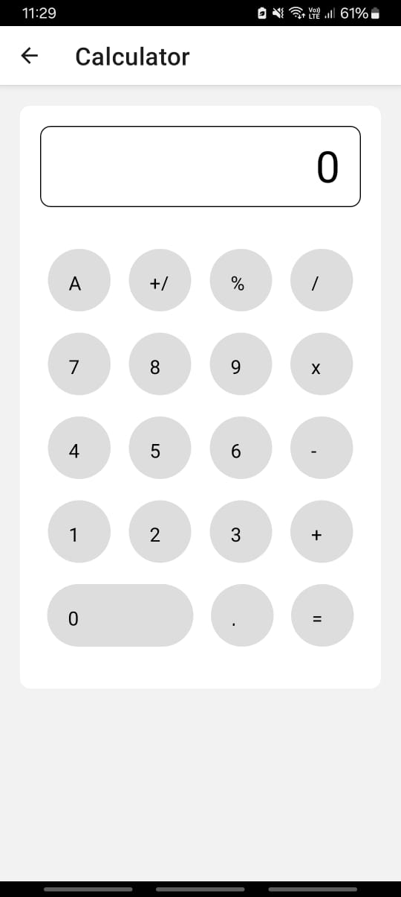
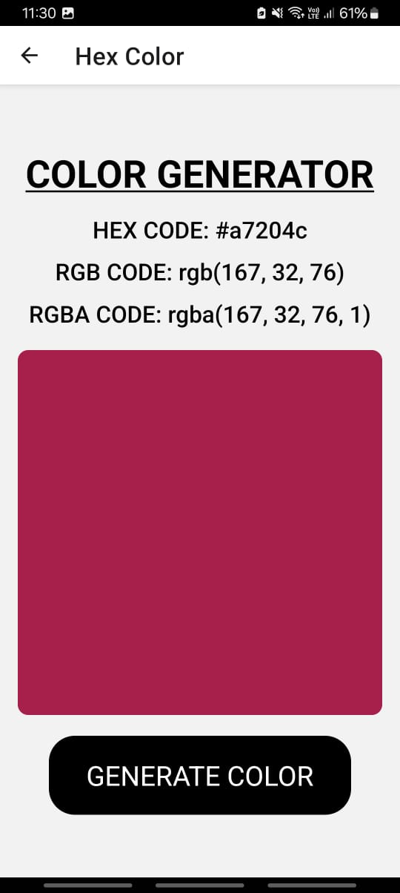
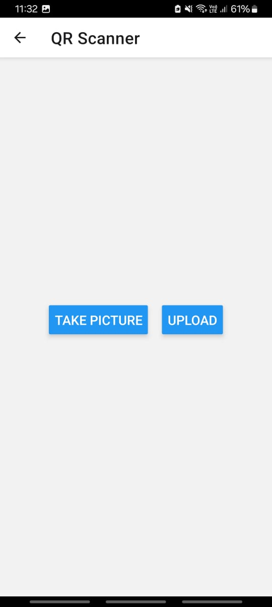
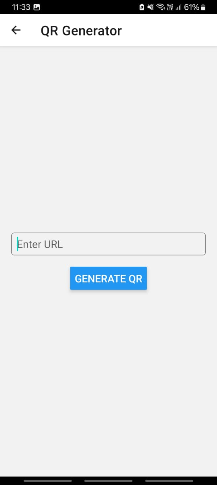
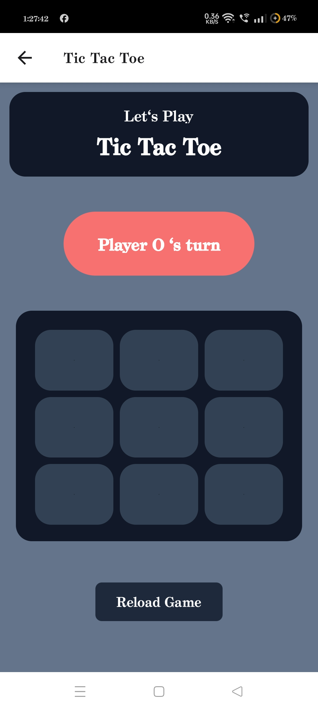

<h1 align="center" id="title"> 📲 BasicNative 📲</h1>

<p id="description">A collection of beginner friendly projects based on React Native Expo to help beginners get started with Application Development.</p>

<h2>📸 Project Screenshots: 📸</h2>

<table>
  <tr>
    <th>Basic Components</th>
    <th>Image Gallery</th>
    <th>Rock Paper Scissors Game</th>
    <th>Book Finder</th>
   
  </tr>
  <tr>
    <td>  </td>
    <td>  </td>
    <td> </td>
    <td>  </td>
  </tr>
  <tr>
 <th>Calculator</th>
    <th>Movie Finder</th>
    <th>Color Generator</th>
    <th>To Do List</th>
  </tr>

<td></td>
    <td></td>
    <td></td>
    <td></td>
    </tr>
<tr>
    <th>QR Scanner</th>
    <th>QR Generator</th>
    <th>Tic Tac Toe</th>
    </tr>
  <tr>
    <tr>
    <td></td>
    <td></td>
    <td></td>
  </tr>
</table>


<hr>

<h2>🧐 Features 🧐</h2>

Here're some of the project's best features:

*   Beginner friendly projects
*   Easy to understand code
*   Implementation of all the fundamental concepts of React Native

  
<hr>
  
<h2>💻 Built with 💻</h2>

Technologies used in the project:

*   React Native Expo
*   Tailwind CSS


<hr>


<h2>🛠️ Installation Steps: 🛠️</h2>

<p>1. Clone the repository</p>

```
git clone "https://github.com/smilewithkhushi/BasicNative.git"
```

<p>2. Change the working directory</p>

```
cd BasicNative
```

<p>3. Open the Visual Studio Code (recommended)</p>

```
code .
```

<p>4. Install required packages</p>

```
npm install 
```

<p>5. Start the deployment server</p>

```
npx expo
```

<p>6. Start the Native Expo Project</p>

```
npx expo start
```

<hr>

<h2>🛠️ Fixing: 🛠️</h2>

<p>There are a few points that needs to be taken care of when working with React Native.It might be possible that the app might not produce the required results due to version discrepencies. During such issues the following options can be utilised: </p>
<p>1. Try to downgrade or upgrade the 'Expo Go' app when there is version incompatibility.</p>
<p>2. In case of node_modules incompatibility the following command comes into roleplay.</p>

```
npx expo install --fix
```
<p>3. If there is an issue to use commands containing 'expo' then, the following command would help in fixing the issue.</p>

```
npm install -g react-native-cli
```
<p>4. If there is an error while using the QR Scanner or QR Generator try to use the below given commands.</p>

```
npm install react-native-qrcode-svg
```

<hr>
  
<h2>🛡️ License: 🛡️ </h2>

This project is licensed under the MIT
